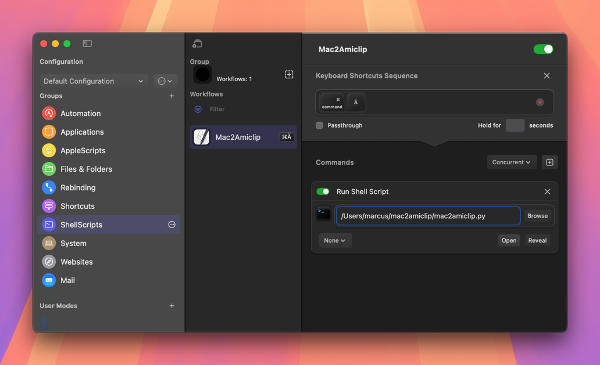

# Copy2AmiClip
Copy clipboard on Mac, Windows or Linux to Amiga over network.
## About and Why
When I started to revive my Amiga, I often had the situation that I researched things on my modern computer (a Mac in my case) that I would have liked to transfer quickly to my Amiga. Things like code snippets, URLs, ....

Always writing them to a file and transferring via FTP or even typing was tedious and error-prone. So I thought a cross-device copy and paste would be nice. Just like I knew it from my Apple devices. That's how Copy2AmiClip was born. At first only as an Amiga-DOS script, now as an AREXX script on the Amiga side. On the modern side, I have scripts in Python and Shell. Actually, it was designed and tested only on macOS. But it's easy to make them run on Windows or Linux as well.
## Tech
You may wonder why the text copied over the network is Base64 encoded. This is because I had many problems when the text included special characters. So the easiest way to work around this was to encode it this way.
## Requirements
- On the Amiga side, you need a working TCP network. I use the RoadShow Stack.
- You need some additional ARexx libs from Aminet. RexxTricks Lib: http://aminet.net/package/util/rexx/RexxTricks_386.lha and RXSocket Lib:   http://aminet.net/package/comm/tcp/rxsocket.
## Installation
### Amiga
Copy copy2amigaclip.rexx to s: and put this in your s:user-startup

    run <>nil: rx s:copy2amigaclip.rexx > nil:
### Mac
Install Python 3 on your Mac if you want to use the Python version. I prefer Homebrew for that. For the shell version, nothing extra is needed.

Copy mac2amiclip.sh or mac2amiclip.py somewhere on your Mac. I use my home directory.

Set the IP, Port and Codepage to suit your needs.

Then use a shortcut tool like Keyboard Cowboy to set up a shortcut to start the script whenever you want to send your clipboard to your Amiga.

### Linux
ToDo, but mainly the same as on Mac. I have not tested it yet!
### Windows
ToDo, but mainly the same as on Mac. Obviously you can't use the shell version there. I have not tested it yet!
## Usage
Simple! Just press the keyboard shortcut you have configured. Your keyboard tool should then start the script.
## Debug
On the client side, there should be a logfile in /tmp and in t: on the Amiga. If you want to quit the process on the Amiga send a 'quit' (without quotes).
## ToDo
- Writing the code for Windows and Linux.
- Ability to end the task on Amiga.
